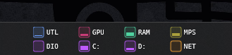

# squares: system monitor skin for Rainmeter

A Rainmeter skin that displays system metrics in compact squares designed to fit inside the Windows taskbar. No external dependencies — built entirely on Rainmeter's built-in measures and the `UsageMonitor` plugin (ships with Rainmeter).

Inspired by [GerosMonitor 2.0](https://www.deviantart.com/geroyuni/art/GerosMonitor-for-Rainmeter-749877799).



## Layout

`squares2.ini` displays 8 metrics in a 4×2 grid:

```text
UTL   GPU   RAM   MPS
DIO   C:    D:    NET
```

| Label | Metric | Source |
| ---------- | -------- | -------- |
| `UTL` | Processor Utility — frequency-scaled CPU load | `UsageMonitor` / `% Processor Utility` |
| `GPU` | GPU engine utilisation | `UsageMonitor` / `GPU Engine` / `Utilization Percentage` (index-based) |
| `RAM` | Physical memory used | `Measure=PhysicalMemory` |
| `MPS` | Memory Page Swap — bytes paged to disk as % of committed memory | Engineered from `SwapMemory` and `PhysicalMemory` |
| `DIO` | Total disk I/O activity | `UsageMonitor` / `% Disk Time` |
| `C:` | C: drive space used | `Measure=FreeDiskSpace` |
| `D:` | D: drive space used | `Measure=FreeDiskSpace` |
| `NET` | Network throughput as % of max speed | `Measure=NetTotal` |

Hover over any square to expand it into a real-time line graph. Mouse away to collapse.

## Features

* **Compact:** Fits inside the Windows taskbar — no desktop real estate consumed.
* **Dependency-free:** Uses only Rainmeter's built-in measures and `UsageMonitor` (bundled with Rainmeter).
* **Engineered metrics:** `MPS` (Memory Page Swap) is derived from existing measures to surface memory pressure beyond simple RAM fill.
* **Resolution scaling:** Set `ScaleFactor = 1` for 1920×1080, or `1.11` for 1920×1200 — all dimensions scale proportionally from a single variable.
* **Taskbar anchoring:** Set `TaskbarX` once. On every Refresh the skin auto-moves to the correct taskbar position for the current resolution — no dragging after display changes.
* **Hover graphs:** Each square expands on hover to reveal a scrolling line graph.
* **Refined UI:** Rounded corners, per-metric subtle glow, and a curated colour palette.

## Installation

1. Download and install [Rainmeter](https://www.rainmeter.net/) if you haven't already.
2. Download the ZIP of this repository and extract it to your Rainmeter skins folder (usually `Documents\Rainmeter\Skins`).
3. Load the skin:
   1. Right-click the Rainmeter tray icon → **Manage**.
   2. Click **Refresh all**.
   3. Expand `squares` (or whatever you named the folder).
   4. Select `squares2.ini` → **Load**.
   5. Set the skin position to **Stay topmost**.
4. Drag the skin onto your taskbar.

## Customization

Edit the `[Variables]` section in `squares2.ini` (right-click the skin → **Edit skin**), then right-click → **Refresh skin** to apply.

| Variable | Description |
| ---------- | ------------- |
| `ScaleFactor` | `1.0` = 1920×1080 · `1.11` = 1920×1200. Scales all dimensions proportionally. |
| `TaskbarX` | Horizontal pixel offset from the left edge of the screen. Set once for your machine. On every **Refresh skin**, the skin moves to `(TaskbarX, taskbar top + TaskbarYOffset)` automatically. |
| `TaskbarYOffset` | Pixels from the top of the taskbar down to the skin's top edge. `2` centres a ~36px skin in a standard 40px taskbar. |
| `FontFace`, `FontSize`, `FontColor` | Label typography. Default: MesloLGL Nerd Font 7pt white. |
| `BackgroundColor` | Skin background in `R,G,B,A`. Set to `0,0,0,0` for fully transparent (recommended when placing on the taskbar). |
| `GPUUsageIndex` | GPU retrieval mode for `[MeasureGPUUsage]`. `-1` = average across detected instances (safer on multi-GPU), `1` = busiest single instance (often closer to Task Manager feel). |
| `*Color` | Per-metric bar/graph/border colour, e.g. `CPUColor`, `GPUColor`. |
| `*BoxColor` | Per-metric square fill — same RGB as `*Color` but alpha 20. |
| `*Label` | Display text for each square, e.g. `ProcUtilLabel = UTL`. |
| `SquareSize`, `GraphWidth`, `Spacing`, `BarPadding`, `LabelWidth`, `LabelPadding` | Dimensions and spacing (all multiplied by `ScaleFactor`). |
| `ColsUsed`, `RowsUsed` | Grid dimensions for background auto-sizing. |

### Network speed

In `[MeasureNetworkPct]`, adjust `25000000` to match your connection's max bytes/sec:

```text
MaxSpeedMbps × 1,000,000 ÷ 8
```

Examples: 200 Mbps → `25000000` · 1 Gbps → `125000000` · 100 Mbps → `12500000`.

### GPU retrieval mode

`[MeasureGPUUsage]` is intentionally **index-based** (not machine-specific), so it works across different hardware without editing `Instance=` strings.

* `GPUUsageIndex = -1`: average across detected GPU Engine instances. Good default when you want stability and to avoid summed spikes.
* `GPUUsageIndex = 1`: busiest current GPU Engine instance. Often feels closer to Task Manager's displayed load.

Notes:

* `Index=0` is the sum of instances and can produce unintuitive values for GPU counters.
* Small differences vs Task Manager are normal because Windows counters are aggregated differently across tools.

## Requirements

* [Rainmeter](https://www.rainmeter.net/) (4.5 or later recommended)

> **`squares.ini`** is deprecated. It was the original 4-column variant using raw `Measure=CPU` and a CoreTemp dependency. Use `squares2.ini` instead.

## License

This project is open-source and available under the [MIT License](LICENSE).
